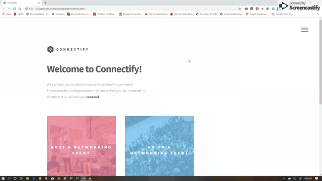

Hi! For our first hackathon, my team and I tried to solve a problem plaguing many undergraduates and graduates-jobs. As the qualifications required have increased in this day and age, a key component of searching for a job is to network. Hence, we made Connectify. Connectify connects you, based on your education level (i.e Undergraduate or Graduate), interests, and location, to networking events to you! You can then click on the event of interest and rsvp via email. 

